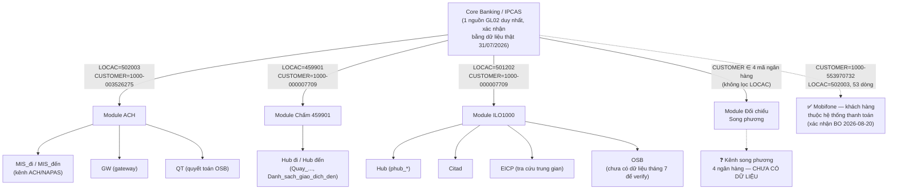

# Từ điển mã/lệnh thanh toán — TTTT

## Đây là gì

Từ điển các mã/lệnh/trường/trạng thái thanh toán xuất hiện trong 4 module đối chiếu của dự án
(ACH, ILO1000, Chấm 459901, Đối chiếu Song phương). **Không dựa trên tài liệu quy chuẩn chính thức** (không có spec từ
NHNN/Agribank/nhà cung cấp hệ thống lõi) — toàn bộ được **suy luận ngược** từ:

1. Code thực tế đang chạy (`backend/services/...`) — nguồn chính của tài liệu này.
2. Comment tiếng Việt do người viết code để lại, khi có.

**Đợt 2 đã bổ sung** — đối chiếu với dữ liệu thật (tần suất, miền giá trị mỗi mã trong file
MIS/GW/OSB/GL02 thật của ACH 31/07–03/08/2026, ILO1000 04-06/07/2026, 459901 tháng 7/2026), dùng để
*kiểm chứng*, không dùng để định nghĩa — xem chi tiết ghi chú "Xác nhận dữ liệu thật" trong từng
bảng và **Phần 5** ở cuối file.

**Vẫn chưa làm** — xác nhận với người/tài liệu quy trình nghiệp vụ nội bộ: nguồn duy nhất xác nhận
được *ý nghĩa nghiệp vụ gốc* của một mã, vì code + dữ liệu chỉ cho biết hệ thống *xử lý* mã đó thế
nào. Danh sách ưu tiên cần hỏi nằm ở Phần 5.

**Đợt 3 (2026-08-20)** — rà soát lại toàn bộ từ điển, đào sâu thêm bằng dữ liệu thật đã có sẵn trên
máy (không phải dữ liệu mới): giải mã thêm GL02 để tra 2 mã lạ liên quan nhau (`1000ITT.../
1000-553970732`, xem Phần 2.1/4.1), trace code + dữ liệu thật để giải thích cơ chế `PrcFlg` biến
mất (Phần 1.6), kiểm tra thêm 6 ngày ACH khác cho `TOPO`/`TXTF`, đối chiếu với tài liệu quy trình
459901 có sẵn (`G:\NGOC HA\Quy_trinh_cham_459901.docx`). Phát hiện thêm 1 vấn đề dữ liệu quan
trọng: 2 file `GL02_20260731_1000.zip` khác nhau cùng tên (xem Phần 5, ưu tiên cao).

**Module Đối chiếu Song phương** (Phần 4) mới chỉ có bước phân loại, chưa có bước đối chiếu thật —
xem ghi chú riêng đầu Phần 4.

**Nguồn 3 (mới, đang chờ) — tài liệu kỹ thuật/quy trình chính thức.** Business Owner sẽ cung cấp
dần tài liệu kỹ thuật + quy trình nghiệp vụ của các hệ thống liên quan. Khi nhận được, nội dung sẽ
được đối chiếu với 2 nguồn hiện có (code + dữ liệu thật) và gộp thẳng vào các bảng bên dưới — xem
mục "Nhật ký cập nhật từ tài liệu chính thức" ở cuối file để biết tài liệu nào đã xử lý.

## Sơ đồ hệ thống thanh toán (tổng hợp từ 4 module)

Sơ đồ dưới đây **suy ra thuần tuý từ những gì đã xác nhận** ở Phần 1-4 (code + dữ liệu thật) —
KHÔNG phải sơ đồ chính thức. Mục đích: khi tài liệu chính thức tới, biết ngay thông tin mới khớp
vào đâu trong bức tranh hiện có, và phần nào (đường nét đứt `❓`) đang là lỗ hổng thật sự cần tài
liệu lấp vào.

**Điểm đáng chú ý (suy từ dữ liệu, chưa xác nhận nghiệp vụ):**
- `Chấm 459901` và `ILO1000` dùng **chung 1 CUSTOMER** (`1000-000007709`) nhưng khác `LOCAC`
  (459901 vs 501202) — gợi ý đây là 2 sổ cái con (sub-ledger) khác nhau của cùng 1 khách hàng/đơn
  vị nội bộ trên Core. Chưa có tài liệu xác nhận ý nghĩa quan hệ này.
- 4 module đã biết đều lọc ra từ **cùng 1 nguồn GL02** — khác nhau ở tổ hợp LOCAC/CUSTOMER dùng để
  lọc. Nếu tài liệu chính thức có bảng "danh mục LOCAC/CUSTOMER toàn hệ thống", đó sẽ là mảnh còn
  thiếu quan trọng nhất để lấp đầy `UNK` và xác nhận các LOCAC/CUSTOMER hiện tại không phải trùng
  hợp ngẫu nhiên. **Đợt 3 (2026-08-20):** `UNK` (CUSTOMER=`1000-553970732`) có REMARK 100% là
  "Công ty Cổ phần Thanh toán số Mobifone" và REFERENCE cùng định dạng `1000ITT...` với 1 dòng lạ
  từng gặp ở ILO1000 (Phần 2.1). **Business Owner đã xác nhận (2026-08-20): Mobifone chỉ là khách
  hàng thuộc hệ thống thanh toán** — dùng chung LOCAC kênh ACH (502003), không phải ngân hàng thứ 5
  của Song phương. Câu hỏi kỹ thuật còn lại (không phải nghiệp vụ): vì sao dòng lẻ `1000ITT...` ở
  ILO1000 lọt qua filter `LOCAC=501202` — xem Phần 2.1.
- Kênh song phương (4 ngân hàng) là nhánh duy nhất hoàn toàn chưa có dữ liệu phía kênh — bất kỳ tài
  liệu nào về định dạng file/luồng dữ liệu 4 ngân hàng này đều ưu tiên cao nhất.

## Cách đọc bảng

Mỗi mã có 4 cột: **Mã** | **Ý nghĩa suy luận** | **Nguồn (file:line)** | **Độ tin cậy**.

Độ tin cậy:
- **Cao** — có comment tiếng Việt giải thích rõ ràng trong code, đã được Business Owner xác nhận
  trực tiếp (ghi rõ trong comment), hoặc **đã xác nhận bằng tài liệu chính thức** (ghi rõ tên tài
  liệu + ngày trong ô "Ý nghĩa suy luận", xem "Nhật ký cập nhật" cuối file).
- **Trung bình** — suy từ logic xử lý (if/else, cách ghép khoá) nhưng không có comment giải thích.
- **Thấp** — chỉ đoán từ tên biến, chưa có logic hay comment nào xác nhận.
- **Không biết** — chỉ thấy dùng để so khớp/phân loại hoặc liệt kê cột, không rõ ý nghĩa gì cả.

Khi tài liệu chính thức **mâu thuẫn** với code/dữ liệu thật (VD: tài liệu nói mã X nghĩa là A,
nhưng code lại xử lý như thể nghĩa là B) — ghi rõ CẢ HAI, gắn cờ "⚠️ mâu thuẫn với code/dữ liệu",
KHÔNG âm thầm ghi đè. Mâu thuẫn kiểu này tự nó là một phát hiện quan trọng (có thể là bug, có thể
là tài liệu lỗi thời) cần báo lại Business Owner, không phải lỗi cần "sửa cho khớp".

⚠️ **Không suy diễn thêm khi đọc bảng này.** Nếu một dòng ghi "chưa rõ" / "không biết", nghĩa là
code không thể hiện — đừng tự đoán tiếp theo hướng nào "nghe hợp lý". Đây đúng là bẫy đã từng gặp
trong dự án (suy diễn ý nghĩa cột từ tương quan quan sát được thay vì từ Business Rule đã xác nhận).

---

## Phần 1 — ACH

*Nguồn: `backend/services/ach/` (b1–b11, pipeline.py, validate.py, so_tien.py, osb_common.py,
zip_utils.py, config.py) và `backend/services/ach_service.py`.*

### 1.1 Mã trạng thái lệnh (TRANG_THAI_LENH)

**MIS_đi:**

| Mã | Ý nghĩa suy luận | Nguồn (file:line) | Độ tin cậy |
|---|---|---|---|
| `CALD` | Bị loại hẳn khỏi MIS_đi ngay Bước 1, không dùng lại cho mục đích nào khác. Ý nghĩa viết tắt không được giải thích. Xác nhận dữ liệu thật 31/07–03/08/2026: có xuất hiện thật trên MIS_đi thô, 0 dòng còn lại trong `MIS_DI_THUA` (đúng — đã bị loại từ Bước 1). | `ach/b4_xu_ly_mis_di.py:23,286-287` | trung bình |
| `ERPO` | Cùng nhóm loại trừ với CALD/TPER. Xác nhận dữ liệu thật 31/07–03/08/2026. | `ach/b4_xu_ly_mis_di.py:23,286-287` | trung bình |
| `TPER` | Cùng nhóm loại trừ với CALD/ERPO. Xác nhận dữ liệu thật 31/07–03/08/2026. | `ach/b4_xu_ly_mis_di.py:23,286-287` | trung bình |
| `TPAY` | Lệnh "chưa được xử lý — cần theo dõi"; trong nhóm CN_TIỀN thừa được xét đại diện cho case "Timeout" (lệnh gửi đi nhưng chưa/không đi kênh). Xác nhận dữ liệu thật 31/07–03/08/2026. | `ach/b8_phan_tich.py:30-32,67-70,123`; `ach/b4_xu_ly_mis_di.py:441-446` | cao |
| `TXRT` | "Hoàn trả — cần kiểm tra". Xác nhận dữ liệu thật 31/07–03/08/2026. | `ach/b8_phan_tich.py:124` | cao |
| `SCNL` | "Đã thanh toán — có thể thuộc session khác, bình thường". Xác nhận dữ liệu thật 31/07–03/08/2026 — 100% dòng còn lại trong `MIS_DI_THUA_20260731.csv` (75.118 dòng) là SCNL, đúng như mô tả (CALD/ERPO/TPER đã bị loại từ Bước 1). | `ach/b8_phan_tich.py:123` | cao |
| `TXPR` | Chỉ được nêu như ví dụ "trạng thái khác ngoài TPAY phát sinh theo thời gian", không có logic phân loại riêng. Xác nhận dữ liệu thật: xuất hiện đúng 1 dòng (31/07/2026) trong 4 ngày mẫu — hiếm nhưng có thật. | `ach/b4_xu_ly_mis_di.py:445` | không biết |
| `TXCA` | Chỉ được nêu như ví dụ, không có logic phân loại riêng. **Không quan sát được** trong 6 ngày mẫu 31/07–03/08/2026 — không phủ nhận việc mã này tồn tại, chỉ chưa gặp trong dữ liệu đã kiểm tra. | `ach/b4_xu_ly_mis_di.py:445` | không biết |
| `TOPO` | ⚠️ **Mã thật ngoài từ điển, không có trong code/comment nào.** Xuất hiện đúng 1 dòng (31/07/2026) trong 6 ngày mẫu đợt 1. **Đợt 3 (2026-08-20) kiểm tra thêm 6 ngày khác** (05,06,07,08,09,12/08/2026, ~3,7 triệu dòng MIS_đi thô từ `doichieugd_*_DI_9999_N.zip`) — **không xuất hiện lại**, cũng không phát sinh mã lạ nào khác ngoài 6 mã đã biết. Củng cố khả năng là ca hiếm/lỗi gõ, không phải mã hệ thống thường dùng bị bỏ sót. Vẫn cần Business Owner xác nhận ý nghĩa. | Dữ liệu thật, không có trong code | không biết |
| `TXTF` | ⚠️ **Mã thật ngoài từ điển, không có trong code/comment nào.** Xuất hiện đúng 1 dòng (03/08/2026) trong 6 ngày mẫu đợt 1. **Đợt 3 (2026-08-20)**: cùng kết quả như `TOPO` — không xuất hiện lại trên 6 ngày kiểm tra thêm. Cần Business Owner xác nhận ý nghĩa. | Dữ liệu thật, không có trong code | không biết |

**MIS_đến:**

| Mã | Ý nghĩa suy luận | Nguồn (file:line) | Độ tin cậy |
|---|---|---|---|
| `RJCT` | Bị loại khỏi MIS_đến (BR gốc mục 6.3, không tính vào đối chiếu). Ý nghĩa tên viết tắt không được giải thích. Xác nhận dữ liệu thật 31/07–03/08/2026: 56-108 dòng/ngày trên MIS_đến thô, **0 dòng** còn lại trong `MIS_DEN_THUA_20260731.csv` (84.330 dòng) — đúng logic bị loại trước khi ra file thừa. | `ach/b6_xu_ly_mis_den.py:132-137` | thấp cho tên, cao cho hành vi |
| `PYED` | ⚠️ **KHOẢNG TRỐNG LỚN NHẤT của từ điển.** Không có trong bất kỳ code/comment nào — code chỉ lọc riêng `RJCT`, mọi giá trị khác (kể cả PYED) đi thẳng qua không phân loại. Chiếm **~88-93% khối lượng** MIS_đến thô (534k-602k dòng/ngày, 6 ngày mẫu 31/07–03/08/2026). Chưa dùng được để phân tích nếu không hỏi Business Owner ý nghĩa. | Dữ liệu thật, không có trong code | không biết |
| `SBSC` | Cùng mức độ khoảng trống như PYED — chiếm ~7-8% khối lượng MIS_đến. Không có trong code/comment. | Dữ liệu thật, không có trong code | không biết |
| `SBFL`, `WBIL`, `WFPG`, `RFED` | Xuất hiện với tần suất nhỏ hơn PYED/SBSC nhưng vẫn hoàn toàn ngoài từ điển — không có trong code/comment nào. | Dữ liệu thật, không có trong code | không biết |
| `'ACH Từ chối'` (giá trị `PrcFlg`, không phải TRANG_THAI_LENH) | Trạng thái GW bị loại khỏi dữ liệu GW sạch trước khi so khớp. Xác nhận dữ liệu thật 31/07/2026: 316/1.077.333 dòng trên GW gốc, 0 dòng còn lại trong `RAW_GW_20260731.csv` (523.951 dòng) — đúng logic bị loại. | `ach/b3_xu_ly_gw.py:158-161` | cao |

### 1.2 Mã kênh / loại lệnh

| Mã | Ý nghĩa suy luận | Nguồn (file:line) | Độ tin cậy |
|---|---|---|---|
| `LOAI_LENH_OSB = 'O'` | Lệnh OSB chiều **đi** trên MIS_đi (verify trên dữ liệu thật — chữ 'O', không phải số 0). | `ach/osb_common.py:5-16` | cao |
| `LOAI_LENH_OSB = '1'` | Lệnh OSB chiều **đến** trên MIS_đến (verify dữ liệu thật). | `ach/osb_common.py:5-11,19-21` | cao |
| `TRTP = 'Normal'` | Điện GL02 gốc dương (bình thường), nửa cặp đối ứng của "điện đi huỷ trong ngày". **Xác nhận trực tiếp từ GL02 gốc** (giải mã bằng `ZIP_PASSWORD`, `GL02_20260731_1000.zip`, 3.811.704 dòng): `Normal` = 3.810.098 dòng, đúng chỉ 2 giá trị tồn tại. | `ach/b10_xu_ly_npo_di_thua.py:18-19` | cao |
| `TRTP = 'Cancel'` | Điện GL02 huỷ (CRAMOUNT âm); bắt cặp cùng REFERENCE/nhóm tổng=0 với dòng Normal → "huỷ trong ngày", đứng riêng → "huỷ khác ngày". **Xác nhận trực tiếp từ GL02 gốc**: `Cancel` = 1.606 dòng. | `ach/b10_xu_ly_npo_di_thua.py:18-23,48` | cao |
| `'Kiểu giao dịch' = 'Cancel'` (file QT) | Lệnh huỷ trong file Quyết toán OSB — chỉ thấy ở QT đi, Số tiền âm, giữ nguyên không lọc riêng (BO xác nhận). | `ach/b9_doi_chieu_osb.py:71-73` | cao |
| `'Chiều giao dịch' = 'GD đi' / 'GD về'` | File QT là quyết toán chiều đi / chiều đến. | `ach/b9_doi_chieu_osb.py:84-93` | cao |

### 1.3 Khoá đối chiếu (tự tính trong code)

| Mã | Công thức / ý nghĩa | Nguồn (file:line) | Độ tin cậy |
|---|---|---|---|
| `SO_TRACE` (GL02) | 12 ký tự từ vị trí thứ 8 của `REFERENCE`, bỏ số 0 đầu — theo "mục 4.1 tài liệu đối chiếu" (tài liệu ngoài code). | `ach/b2_xu_ly_gl02.py:131-134` | cao |
| `SO_TRACE` (MIS_đi) | `SE_TRACE` ưu tiên, fallback `TRACE` nếu rỗng, cả 2 bỏ số 0 đầu. | `ach/b4_xu_ly_mis_di.py:111-114` | trung bình |
| `KEY_DI` | `TRBRCD + SO_TRACE + CRAMOUNT` — khoá NPO_đi (GL02, CRAMOUNT≠0). | `ach/b2_xu_ly_gl02.py:136-141` | cao |
| `KEY_DEN` | `TRBRCD + SO_TRACE + DRAMOUNT` — khoá NPO_đến (GL02, CRAMOUNT=0). | `ach/b2_xu_ly_gl02.py:143-148` | cao |
| `KEY_HUB` | `CHI_NHANH + SO_TRACE + SO_TIEN` — khoá đối chiếu MIS_đi ↔ NPO. | `ach/b4_xu_ly_mis_di.py:156-164` | cao |
| `KEY_DEN_HUB` | `CHI_NHANH + TRACE(bỏ 0 đầu) + SO_TIEN` — khoá đối chiếu MIS_đến ↔ NPO. | `ach/b6_xu_ly_mis_den.py:139-144` | cao |
| `'CN tiền Hub'` | `CHI_NHANH + SO_TIEN` (không TRACE) — khoá đối chiếu MIS_đi ↔ GW. | `ach/b4_xu_ly_mis_di.py:156-164` | cao |
| `KEY_GW` | `BRCD + STTLMAMT` — "CN TIỀN" bên GW, đối ứng `'CN tiền Hub'`. | `ach/b3_xu_ly_gw.py:176-179` | cao |
| `CN_TRACE_TIEN` | `mã CN thực hiện + Mã giao dịch(bỏ 0 đầu) + Số tiền` — khoá QT, cùng công thức MIS (KEY_HUB/KEY_DEN_HUB). | `ach/b9_doi_chieu_osb.py:62-102` | cao |
| `MATCH_TYPE = 'TIMEOUT'` | Dòng MIS_đi thừa nhóm nhưng MSGREF đã tồn tại trên GW sạch — "Timeout thật, đã được kênh xác nhận, KHÔNG phải thừa" (BR-ACH-001 nhánh 1B). | `ach/b4_xu_ly_mis_di.py:419-470` | cao |
| `CHECK_TRUNG` | `TRBRCD + SO_TRACE` — nhóm tìm cặp Normal/Cancel cùng ngày (điện đi huỷ trong ngày). | `ach/b10_xu_ly_npo_di_thua.py:9-10,38` | cao |

### 1.4 Mã trường định danh giao dịch

| Mã | Ý nghĩa suy luận | Nguồn (file:line) | Độ tin cậy |
|---|---|---|---|
| `MSGREF` | Định danh duy nhất 1 giao dịch trên GW/MIS — dùng loại trùng và tra tồn tại/không tồn tại để phân loại Timeout. Tên viết tắt không được giải thích. | `ach/b3_xu_ly_gw.py:45-54`; `ach/b4_xu_ly_mis_di.py:419-470` | trung bình |
| `REFHUB` | Định danh giao dịch MIS_đi thô — dùng cho checkpoint chấm tay. Trùng ≥2 dòng → raise lỗi, không tự chọn. | `ach/b4_xu_ly_mis_di.py:610-720` | trung bình |
| `SessionId` (GW) | Phiên xử lý dòng GW — phân loại 'thuần nhất'/'lận cận'/'không liên quan', tra SessionId thật cho MIS SESSION=NULL. | `ach/b3_xu_ly_gw.py:27-42`; `ach/b4_xu_ly_mis_di.py:167-257` | cao |
| `SESSION` (MIS) | Phiên xử lý giao dịch MIS — lọc đúng session, xử lý riêng khi rỗng. | `ach/b4_xu_ly_mis_di.py:282-308`; `ach/b6_xu_ly_mis_den.py:121-129` | cao |
| SessionId/SESSION rỗng | "SESSION = NULL" — luồng xử lý riêng, không lọc theo khung giờ (BR mới 2026-07-23). **Chưa quan sát được trong 6 ngày mẫu 31/07–03/08/2026** — SessionId (GW) không có dòng rỗng nào (0/1.077.333), SESSION (MIS_đi/đến raw) cũng rỗng = 0 dòng trong mọi ngày kiểm tra. Không phủ nhận việc case này tồn tại, chỉ chưa gặp trong dữ liệu đã kiểm tra — cần kiểm tra thêm ngày khác. | `ach/zip_utils.py:16`; `ach/b4_xu_ly_mis_di.py:283-284` | trung bình |
| `SessionId = '0000'` | Giá trị đặc biệt trên GW gốc khiến MIS SESSION=NULL được GIỮ lại (nhãn `GW_SESSION_0000`) — ý nghĩa nghiệp vụ của '0000' không được giải thích. Xác nhận dữ liệu thật 31/07/2026: **23/1.077.333 dòng** trên GW gốc mang SessionId='0000' (bên cạnh 3 giá trị session thường: 16446, 16448, 16450). | `ach/b4_xu_ly_mis_di.py:223,241-242` | thấp |
| `'__NHIEU__'` | Marker 1 MSGREF có ≥2 SessionId khác nhau trên GW gốc (dữ liệu chưa dedup) — không tự chọn theo vị trí. | `ach/b4_xu_ly_mis_di.py:167-179,232-233` | cao |
| session_id (từ tên file PDF, `_NRT_(\d+)_`) | Số phiên đối chiếu cả ngày, dùng lọc MIS_đi/đến/GW. | `ach/b1_doc_session.py:6-35` | cao |

### 1.5 Mã trường nguồn GL02 (NPO)

| Mã | Ý nghĩa suy luận | Nguồn (file:line) | Độ tin cậy |
|---|---|---|---|
| `LOCAC = '502003'` | "Mã đơn vị hạch toán kênh ACH trên GL02". **Xác nhận trực tiếp từ GL02 gốc** (giải mã bằng `ZIP_PASSWORD`, `GL02_20260731_1000.zip`, 3.811.704 dòng, chỉ 2 giá trị LOCAC tồn tại): `502003` = 976.930 dòng (26% tổng), `502001` = 2.834.774 dòng (kênh khác). | `ach/b2_xu_ly_gl02.py:20-23,79-83,112-116` | cao |
| `CUSTOMER = '1000-003526275'` | Mã khách hàng ACH — lọc thêm vì 1 LOCAC có thể có nhiều CUSTOMER. **Xác nhận trực tiếp từ GL02 gốc**: 976.877 dòng (khớp gần đúng với LOCAC=502003, chênh 53 dòng do CUSTOMER khác dùng chung LOCAC). | `ach/b2_xu_ly_gl02.py:21-24,81-83,114-116` | cao |
| `TRBRCD` | Mã chi nhánh GL02, ghép KEY_DI/KEY_DEN, đối ứng `CHI_NHANH` bên MIS. | `ach/b2_xu_ly_gl02.py:137-148` | trung bình |
| `CRAMOUNT ≠ 0` | Dòng GL02 là NPO_đi. | `ach/b2_xu_ly_gl02.py:126-136` | cao |
| `CRAMOUNT = 0` (dùng `DRAMOUNT`) | Dòng GL02 là NPO_đến. | `ach/b2_xu_ly_gl02.py:126-127,143-148` | cao |
| `TRDATE, USERID, JOURSEQ, DYTRSEQ, CCY, BUSCD, UNIT, TRCD, REMARK, CRTDTM` | Chỉ trong danh sách cột đọc (`COLS_NPO`), không có logic phân loại nào dùng. | `ach/config.py:6-10` | không biết |

### 1.6 Mã trường nguồn GW

| Mã | Ý nghĩa suy luận | Nguồn (file:line) | Độ tin cậy |
|---|---|---|---|
| `BRCD` | Mã chi nhánh GW — ghép `KEY_GW`, đối ứng `TRBRCD`/`CHI_NHANH`; cũng dùng dò header row. | `ach/b3_xu_ly_gw.py:5-11,177` | trung bình |
| `STTLMAMT` | Số tiền GW (nghi "Settlement Amount") — làm sạch trước khi ghép khoá. | `ach/b3_xu_ly_gw.py:169-177` | trung bình |
| `PrcFlg` | Cờ trạng thái xử lý GW — code chỉ có logic loại rõ ràng cho `'ACH Từ chối'`; **không được dùng để quyết định phân loại Timeout** (chỉ MSGREF mới quyết định). | `ach/b3_xu_ly_gw.py:158-167`; `ach/b4_xu_ly_mis_di.py:438-439` | trung bình |
| `PrcFlg = 'Lệnh Hoàn thành'` | Đa số bản ghi GW (1.076.825/1.077.333 dòng gốc 31/07/2026). Còn lại đầy đủ trong GW sạch đã lọc (`RAW_GW_20260731.csv`: 523.802 dòng). | Dữ liệu thật, không có trong code | cao (hành vi: không bị lọc) |
| `PrcFlg = 'Lệnh Timeout'` | 158/1.077.333 dòng gốc. Vẫn còn 149 dòng trong GW sạch đã lọc — **không bị lọc** giống `ACH Từ chối`. | Dữ liệu thật, không có trong code | trung bình (hành vi rõ, ý nghĩa tên chưa xác nhận) |
| `PrcFlg = 'Đang sửa'` | 23/1.077.333 dòng gốc. **Đợt 3 (2026-08-20) đã xác định được cơ chế:** cả 23 dòng đều có `SessionId = '0000'` (giá trị đặc biệt, xem dòng "SessionId = '0000'" bên dưới) — khác session mục tiêu của ngày 31/07 (16448) — nên bị loại bởi chính bộ lọc session (`b3_xu_ly_gw.py:160-162`, `mask_sai_session`), **không phải bị lọc riêng theo PrcFlg** (code chỉ lọc rõ `'ACH Từ chối'`). Cơ chế biến mất đã rõ; lý do NGHIỆP VỤ vì sao các dòng này mang SessionId='0000' vẫn chưa xác nhận. | `ach/b3_xu_ly_gw.py:160-162`; xác nhận dữ liệu thật `đi GW 31.07.xlsx` | cao (cơ chế); không biết (lý do nghiệp vụ) |
| `PrcFlg = 'Chờ hoàn trả'` | 11/1.077.333 dòng gốc. **Đợt 3 (2026-08-20):** cả 11 dòng đều có `SessionId = '16446'` — session của một ngày TRƯỚC đó (khác 16448 của 31/07) — cùng cơ chế bị lọc bởi `mask_sai_session`, không phải PrcFlg. Có vẻ là các dòng còn sót của phiên trước xuất hiện lẫn trong file GW ngày sau; lý do nghiệp vụ cụ thể chưa xác nhận. | `ach/b3_xu_ly_gw.py:160-162`; xác nhận dữ liệu thật `đi GW 31.07.xlsx` | cao (cơ chế); không biết (lý do nghiệp vụ) |

### 1.7 Mã trường nguồn MIS (đi/đến)

| Mã | Ý nghĩa suy luận | Nguồn (file:line) | Độ tin cậy |
|---|---|---|---|
| `CHI_NHANH` | Mã chi nhánh MIS, ghép mọi khoá đối chiếu MIS. | `ach/b4_xu_ly_mis_di.py:156-164`; `ach/b6_xu_ly_mis_den.py:139-144` | cao |
| `SO_TIEN` | Số tiền giao dịch MIS — thành phần bắt buộc mọi khoá. | `ach/b4_xu_ly_mis_di.py:122,160-161` | cao |
| `NGAY_GIAO_DICH` | Ngày giá trị giao dịch — so với ngày T/T-1 để giữ/loại MIS SESSION=NULL. | `ach/b4_xu_ly_mis_di.py:213-218`; `ach/b6_xu_ly_mis_den.py:124-127` | cao |
| `NGAY_KENH_TRA` | Parse datetime, hiển thị báo cáo — không thấy logic phân loại dùng trực tiếp. | `ach/b4_xu_ly_mis_di.py:118-127` | thấp |
| `MSGSEQ, TXID, KENH_THANH_TOAN, MA_GIAO_DICH, NOI_DUNG` | Chỉ trong danh sách cột đọc/hiển thị, không có logic riêng. | `ach/b4_xu_ly_mis_di.py:25-30`; `ach/b6_xu_ly_mis_den.py:23-27` | không biết |
| `NH_NHAN` (MIS_đi), `NH_GUI` (MIS_đến) | Cột hiển thị, tên gợi ý "ngân hàng nhận/gửi", không có logic riêng. | `ach/b4_xu_ly_mis_di.py:26-30`; `ach/b6_xu_ly_mis_den.py:23-27` | thấp |

### 1.8 File QT (Quyết toán OSB)

| Mã | Ý nghĩa suy luận | Nguồn (file:line) | Độ tin cậy |
|---|---|---|---|
| `'STT'` + `'Số tiền'` | Marker dò đúng header row / đúng sheet dữ liệu QT. | `ach/b9_doi_chieu_osb.py:13-21,40-59` | cao |
| `'CN thực hiện'` | `<mã CN> - <tên>`, trích mã số đầu chuỗi làm mã chi nhánh QT. | `ach/b9_doi_chieu_osb.py:96-98` | cao |
| `'Mã giao dịch'` | Số trace QT, bỏ số 0 đầu — đối ứng TRACE bên MIS. | `ach/b9_doi_chieu_osb.py:99` | cao |

### 1.9 Nhãn kết quả tự sinh (nội bộ hệ thống)

| Nhãn | Ý nghĩa | Nguồn (file:line) | Độ tin cậy |
|---|---|---|---|
| `GHI_CHU_T2 = 'Hạch toán lệnh ngày T-2'` | Gắn lên dòng NPO_đi/đến thừa khi khớp với MIS thừa T-2. | `ach/b11_doi_chieu_cheo_ngay.py:8` | cao |
| `KETQUA_OSB_DI_KHOP/CHUA`, `KETQUA_OSB_DEN_KHOP/CHUA`, `KETQUA_KHONG_CO_QT`, `KETQUA_THUONG_KHOP/CHUA` | Nhãn `KET_QUA` trên file MIS thừa T-2, theo đúng mẫu docx "NGUYEN TAC DOI CHIEU DIEN MIS THUA NGAY T-1". ⚠️ Giá trị **thật xuất hiện trong dữ liệu** (`MIS_DI/DEN_THUA_T2_KETQUA_*.csv`) là chuỗi tiếng Việt hiển thị, không phải tên hằng số — mapping chính xác (đọc trực tiếp từ code): `KETQUA_OSB_DI_KHOP` = `"lệnh đi OSB ngày T-2 hạch toán QT ngày T-1"`; `KETQUA_OSB_DI_CHUA` = `"OSB đi chưa hạch toán"`; `KETQUA_OSB_DEN_KHOP` = `"lệnh đến OSB ngày T-2 hạch toán QT ngày T-1"`; `KETQUA_OSB_DEN_CHUA` = `"OSB đến chưa hạch toán"`; `KETQUA_KHONG_CO_QT` = `"Không có QT ngày T-1 để đối chiếu"`; `KETQUA_THUONG_KHOP` = `"lệnh ngày T-2 hạch toán ngày T-1"`; `KETQUA_THUONG_CHUA` = `"lệnh chưa hạch toán"`. Cả 4 chuỗi mẫu quan sát được trên dữ liệu 02/08/2026 đều khớp đúng nhóm này. | `ach/b11_doi_chieu_cheo_ngay.py:8,14-20` | cao |
| `LY_DO_GIU_SESSION_NULL` (8 giá trị: `NGAY_GIA_TRI_KHAC_T_VA_T-1`, `GW_GOC_NHIEU_SESSIONID_KHAC_NHAU`, `KHONG_TIM_THAY_TREN_GW`, `GW_SESSION_NULL`, `GW_SESSION_0000`, `GW_SESSION_DOI_CHIEU`, `GW_SESSION_KHAC`, `KHONG_TIM_THAY_TREN_GW_TAI_T-1`) | 8 lý do giữ/loại giao dịch MIS_đi SESSION=NULL, mỗi nhãn có docstring giải thích rõ. | `ach/b4_xu_ly_mis_di.py:182-257` | cao |

### 1.10 Định dạng số tiền

| Mẫu | Ý nghĩa | Nguồn (file:line) | Độ tin cậy |
|---|---|---|---|
| `'180000'` | Số thuần, parse trực tiếp. | `ach/so_tien.py:20,24-37` | cao |
| `'180.000'` | Dấu chấm LUÔN là ngăn nghìn, không bao giờ thập phân (chốt với Business Owner 2026-08-10/11). | `ach/so_tien.py:8-21` | cao |
| Mẫu khác (VD `'1.5'`) | Raise lỗi, không đoán 15 hay 1,5. | `ach/so_tien.py:14,30-35` | cao |

*Không có logic nghiệp vụ trong `validate.py` (chỉ quy ước đặt tên file) và `ach_service.py` (chỉ trạng thái job kỹ thuật: pending/running/awaiting_confirmation/done/error/cancelled).*

---

## Phần 2 — ILO1000

*Nguồn: `backend/services/ilo1000/` (process.py, config.py, detect.py, load_core.py, load_eicp.py, load_osb.py, export.py).*

### 2.1 Mã trong "Số giao dịch" / "REFERENCE" — quyết định cách tính Trace

| Mã | Ý nghĩa suy luận | Nguồn (file:line) | Độ tin cậy |
|---|---|---|---|
| `'S'` trong "Số giao dịch" (Hub) | Giao dịch phải qua bước tra EICP/BFX để lấy Trace, thay vì dùng thẳng Số Trace 1/2. Xác nhận dữ liệu thật (bộ `4-6.7.2026`, ngày 06/07/2026, 88.483 dòng Hub): **49.316/88.483** dòng chứa 'S'. | `ilo1000/process.py:44-48` | cao |
| `'BFX'` trong "Nội dung chuyển tiền" (Hub) | Nhóm 'S': Trace = 16 ký tự cuối nội dung chuyển tiền. Ý nghĩa "BFX" cụ thể chưa rõ. Xác nhận dữ liệu thật: **30 dòng**. | `ilo1000/process.py:49,62-64` | trung bình |
| `'SMF'` trong "Số giao dịch" (Hub) | Loại trừ khỏi tra EICP dù thuộc nhóm 'S' — giữ nguyên Số Trace 1 gốc (xác nhận Business Owner 2026-07-16, không giải thích tên "SMF"). Xác nhận dữ liệu thật: **327 dòng**. | `ilo1000/process.py:52,63,69` | trung bình |
| Không chứa `'S'` (chủ yếu "OT") | Hoàn trả lệnh gốc — dùng thẳng "Số Trace 2". | `ilo1000/process.py:42-45,58-60` | cao |
| `'API'` trong REFERENCE (Core) | Trace = `REFERENCE[7:23]` — không có comment giải thích "API". Xác nhận dữ liệu thật (44.569 dòng Core sau filter, ngày 06/07/2026): **23.200 dòng**. | `ilo1000/process.py:231,237` | thấp |
| `'OTT'` trong REFERENCE (Core) | Trace = TRBRCD + `REFERENCE[4:16]`. Trùng với literal `'OTT'` mà EICP dùng dựng `map_core` (mục 2.3) — gợi ý mã loại giao dịch nội bộ Core dùng chung với EICP. Xác nhận dữ liệu thật: **21.355 dòng**. | `ilo1000/process.py:232,238`; `ilo1000/load_eicp.py:49` | trung bình |
| `'BFX'` trong REFERENCE (Core) | Trace = TRBRCD + `REFERENCE[4:16]` — cùng công thức OTT. Xác nhận dữ liệu thật: **9 dòng**. | `ilo1000/process.py:233,239` | thấp |
| `'HI'` trong REFERENCE (Core) | Trace = `'Quyết toán'` → TT = `'quyết toán'`. Loại giao dịch quyết toán, không tra Hub/Citad. Xác nhận dữ liệu thật: **1 dòng**. | `ilo1000/process.py:234,240,262-263` | trung bình |
| `'IBPSILO'` trong REMARK (Core) | Giao dịch kênh OSB, ngoài phạm vi ILO1000 → TT = `'OSB'` (sẽ có module Chấm TK OSB riêng), xác nhận qua dữ liệu thật 04-06/7/2026: **3/3 dòng** khớp đúng (toàn bộ dòng REFERENCE dạng `1000OSB` phát hiện ở dòng dưới). | `ilo1000/process.py:265-272` | cao |
| `REFERENCE` dạng `1000ITT...` (VD thật: `1000ITT261005801`) | Trong 44.569 dòng Core (06/07/2026), có đúng **4 dòng** không rơi vào 4 nhóm API/OTT/BFX/HI: 3 dòng `1000OSB` (đã xác nhận thuộc nhóm OSB ở trên) và **1 dòng `1000ITT261005801`** — REMARK là tên công ty, không khớp bất kỳ mẫu nào đã biết. Không có logic xử lý riêng trong code. **Đợt 3 (2026-08-20):** giải mã thật `GL02_20260731_1000.zip` (bản ACH, LOCAC=502003) cho **53 dòng CUSTOMER=`1000-553970732`** (mã lạ, xem Phần 4.1) — REFERENCE **cùng định dạng `1000ITT2610072xx`**, REMARK **100% là "Công ty Cổ phần Thanh toán số Mobifone"**. **Business Owner đã xác nhận (2026-08-20): Mobifone chỉ là khách hàng thuộc hệ thống thanh toán** — cùng một khách hàng/đối tác với dòng `1000-553970732` ở Song phương (Phần 4.1), dùng chung kênh ACH. Câu hỏi kỹ thuật còn lại: vì sao dòng `1000ITT` lẻ này lọt qua filter `LOCAC=501202` của ILO1000 — chưa truy được nguyên nhân, không phải câu hỏi nghiệp vụ. | Dữ liệu thật (Core 06/07 + GL02 31/07 đã giải mã) | cao (danh tính); thấp (cơ chế lọt filter) |

### 2.2 Mã trạng thái xuất ra (cột TT)

| Mã | Ý nghĩa suy luận | Nguồn (file:line) | Độ tin cậy |
|---|---|---|---|
| `'Hủy'` | Net-zero (tổng Nợ = tổng Có cùng REFERENCE) và ngày lập = ngày hủy. Xác nhận Business Owner 2026-07-16: khác "Đã hủy", không phải lỗi gõ tay. | `ilo1000/process.py:178-206` | cao |
| `'Đã hủy'` | Khác ngày lập/hủy, hoặc thiếu vế gốc trong batch đang xử lý — bắt qua CRAMOUNT<0. | `ilo1000/process.py:178-206` | cao |
| `'quyết toán'` | Dòng Core có Trace = `'Quyết toán'` (loại "HI"), chưa có TT — không cần tra Hub/Citad. | `ilo1000/process.py:261-263` | trung bình |
| `'OSB'` | (a) Core REMARK chứa IBPSILO; (b) Citad thừa khớp trực tiếp khoá OSB. | `ilo1000/process.py:272,320-350` | cao |
| `'citad {day}.{month}'` | Core khớp trúng Map dc của Citad — "khớp format thủ công". | `ilo1000/process.py:148-155` | cao |
| `'Chờ đi kênh'` | "Ngày giờ kênh trả" > ngày đang đối chiếu — chưa đi kênh xong. | `ilo1000/process.py:91-94` | cao |
| `'OSB mới'` / `'OSB cũ'` | 'Ngày hạch toán' == ngày chấm (T) → mới; carryover ngày trước → cũ. | `ilo1000/load_osb.py:88-93` | cao |
| `''` (rỗng) | Không khớp Hủy/Quyết toán/OSB/Citad/Hub — để chấm tay, "không tự suy luận thêm". | `ilo1000/process.py:329-331` | cao |

### 2.3 Khoá ghép so khớp Hub ↔ Citad ↔ Core ↔ OSB

| Khoá | Công thức | Ý nghĩa suy luận | Nguồn (file:line) | Độ tin cậy |
|---|---|---|---|---|
| `Trace` (Hub) | Tuỳ nhóm: Số Trace 2 / right(nội dung,16) nếu BFX / tra EICP nếu 'S' không BFX/SMF / Số Trace 1 giữ nguyên | Định danh dùng chung đối chiếu Citad và Core | `ilo1000/process.py:54-83` | cao |
| `STC` (Hub, "Số thành công") | Cột gốc đổi tên | Khoá tra `stc_to_trace` — nối SERIAL_NO Citad sang Trace Hub. Tên "STC" không giải thích. | `ilo1000/config.py:24`; `ilo1000/process.py:99,105,136-138` | trung bình |
| `Trace` (Citad) | `VLOOKUP(SERIAL_NO, hub.STC → Trace)` | Gán Trace cho Citad qua khoá SERIAL_NO khớp STC Hub | `ilo1000/process.py:135-138` | cao |
| `Map dc` (Citad) | `LEFT(RELATION_NO,4) + Trace + AMOUNT(int)` | Khoá đối chiếu Citad ↔ Core | `ilo1000/process.py:140-144` | cao |
| `Map dc` (Core) | `TRBRCD + Trace + CRAMOUNT(int)` | Khoá đối chiếu Core ↔ Citad | `ilo1000/process.py:245-247` | cao |
| Khoá OSB | `LEFT(CN thực hiện,4) + Mã giao dịch + Số tiền` | So trực tiếp với 'Map dc' Citad còn thừa — xác nhận dữ liệu thật 2026-08-19 (56/80, 54/84 dòng khớp) | `ilo1000/load_osb.py:78-85` | cao |
| `map chung hub` (EICP) | `BRCD + MSGKEY` | Khoá nối "Số giao dịch" Hub → Core qua trung gian EICP | `ilo1000/load_eicp.py:44-48,58` | cao |
| `Map chung core` (EICP) | `BRCD + 'OTT' + TRSEQ` | Trace tương ứng bên Core — literal `'OTT'` chèn cứng, gợi ý mã loại giao dịch cố định (xem 2.1) | `ilo1000/load_eicp.py:49,59` | trung bình |
| `trace_trangthai`, `trace_sotien` | `{Trace(Hub)→Trạng thái}`, `{Trace(Hub)→Số tiền}` | 2 lookup dự phòng cuối để Core tra TT khi không khớp Citad | `ilo1000/process.py:281-296` | cao |

### 2.4 Mã lọc nguồn Core (GL02)

| Mã | Giá trị | Ý nghĩa suy luận | Nguồn (file:line) | Độ tin cậy |
|---|---|---|---|---|
| `CORE_FILTER_LOCAC` | `'501202'` | Mã đơn vị hạch toán, lọc đúng bút toán kênh Citad/ILO1000 trong GL02 chi nhánh 1000 (ILO1000 chỉ ~2% bút toán). | `ilo1000/config.py:67-71`; `ilo1000/load_core.py:47-59` | cao |
| `CORE_FILTER_CUSTOMER` | `'1000-000007709'` | Mã khách hàng/tài khoản nội bộ, lọc kèm LOCAC. | `ilo1000/config.py:70-71`; `ilo1000/load_core.py:55-59` | trung bình |
| `DRAMOUNT == 0` | filter | Chỉ giữ dòng Core có Nợ = 0 — không rõ lý do nghiệp vụ. | `ilo1000/load_core.py:1,108-111` | thấp |
| `CRAMOUNT < 0` | tín hiệu Hủy | "Số tiền (-) thì là hủy lệnh ngày cũ" — dịch trực tiếp từ quy tắc docx gốc. | `ilo1000/process.py:171-176,200` | cao |

### 2.5 Nhận dạng loại file nguồn

| Loại file | Điều kiện | Nguồn (file:line) | Độ tin cậy |
|---|---|---|---|
| `'hub'` | tên bắt đầu `phub_`, đuôi `.xlsx` | `ilo1000/detect.py:15-21` | cao |
| `'osb'` | tên bắt đầu `osb`, đuôi `.xlsx` | `ilo1000/detect.py:22-23` | cao |
| `'eicp'` | tên chứa `eicp`, đuôi `.xls`/`.xlsx` | `ilo1000/detect.py:24-25` | cao |
| `'core_zip'` / `'core_csv'` | tên chứa `gl02`, đuôi `.zip`/`.csv` | `ilo1000/detect.py:26-29` | cao |
| `'citad'` | đuôi `.csv`, header chứa `SERIAL_NO`, `RELATION_NO`, `TRX_STATUS` | `ilo1000/detect.py:30,35-42` | cao |

*Cột `TRCD, BUSCD, UNIT, CCY, JOURSEQ, DYTRSEQ, USERID, TRTP, CRTDTM` xuất hiện trong `CORE_HEADER`/export nhưng không dùng trong bất kỳ if/else phân loại nào — không đưa vào từ điển vì code không thể hiện ý nghĩa phân loại.*

**Chưa verify được — logic "Ngày hạch toán" của OSB (mục 2.2 `'OSB mới'`/`'OSB cũ'`):** không có
dữ liệu OSB tháng 7/2026 hợp lệ trên đĩa. 3 file duy nhất gắn nhãn tháng 7 tại `G:\Cham ILO1000\OSB\`
(`OSB n 10.7.xlsx`, `OSB n 11-12.7.xlsx`, `OSB n 13-17.xlsx`) thực chất chứa dữ liệu **tháng 8/2026**
khi kiểm tra cột "Ngày hạch toán" thật bên trong — khớp đúng với comment đã có sẵn trong code
(`ilo1000/load_osb.py:57-58`: "file 'OSB n 11-12.7.xlsx' chứa dữ liệu ngày 11-12/08, không phải
tháng 7"). Tên file không đáng tin. Cần dữ liệu OSB tháng 7 thật (nếu có) mới verify được.

---

## Phần 3 — Chấm 459901

*Nguồn: `backend/services/cham459901_service.py`, `backend/api/cham459901.py`. Không có schema riêng trong `backend/schemas/`.*

### 3.1 Bộ lọc đầu vào (chọn dòng thuộc TK 459901)

| Mã | Ý nghĩa suy luận | Nguồn (file:line) | Độ tin cậy |
|---|---|---|---|
| `LOCAC = "459901"` | Mã tài khoản 459901 — lọc dòng thuộc TK này. Xác nhận dữ liệu thật tháng 7/2026 (`GL02_20260731_1000.zip`, 5.168.865 dòng, chỉ 3 giá trị LOCAC tồn tại: 502001/459901/502003): `459901` = **1.357.161 dòng** (~26,3%). | `cham459901_service.py:32, 331-335` | trung bình |
| `CUSTOMER = "1000-000007709"` | Mã khách hàng/đối tượng cố định, lọc cùng LOCAC/CCY. Xác nhận dữ liệu thật: **1.355.285 dòng** (chênh 1.876 dòng với LOCAC=459901, hợp lý vì còn điều kiện CCY=VND). | `cham459901_service.py:33, 331-335` | thấp |
| `CCY = "VND"` | Loại tiền tệ, điều kiện lọc. | `cham459901_service.py:34, 331-335` | trung bình |

### 3.2 Mã cột dữ liệu gốc (GL02/IPCAS)

| Mã | Ý nghĩa suy luận | Nguồn (file:line) | Độ tin cậy |
|---|---|---|---|
| `TRDATE` | Ngày giao dịch — chưa rõ, chỉ liệt kê cột. | `cham459901_service.py:39, 49` | thấp |
| `TRBRCD` | Mã chi nhánh — khoá ghép nhóm bước "Chuyển chi nhánh"/"Cân CN"; TRBRCD=1000 nhận diện riêng nhánh Hội sở. | `cham459901_service.py:39, 380, 619, 627` | trung bình |
| `USERID` | Tên đăng nhập giao dịch viên — nhận diện Điện KO offline qua mẫu `<4 số>KO`. | `cham459901_service.py:39, 646` | cao |
| `JOURSEQ` | Số thứ tự bút toán — chưa rõ, không dùng trong phân loại. | `cham459901_service.py:39, 49` | không biết |
| `DYTRSEQ` | Số thứ tự giao dịch — 1 phần khoá xác định cặp Hủy/Normal (`_huy_key`). | `cham459901_service.py:39, 380-381` | trung bình |
| `BUSCD`, `UNIT`, `TRCD` | Chưa rõ, chỉ liệt kê cột, không dùng trong phân loại. | `cham459901_service.py:39` | không biết |
| `TRTP` | Loại giao dịch: `Cancel` / `Normal`, dùng tìm cặp lệnh hủy. **Xác nhận trực tiếp từ GL02 gốc tháng 7/2026** (5.168.865 dòng): đúng chỉ 2 giá trị — `Normal` = 5.163.225, `Cancel` = 5.640, không có giá trị thứ 3. | `cham459901_service.py:39, 383-384` | cao |
| `REFERENCE` | Số tham chiếu — với dòng 1000 Hoàn trả, phần số từ ký tự thứ 8 chính là số Trace của hub. | `cham459901_service.py:39, 542-546, 559` | cao |
| `REMARK` | Nội dung diễn giải — 1 phần khoá "Chuyển chi nhánh" và nhận diện marker `'Remitting Amount:VND'` (Điện KO offline). | `cham459901_service.py:39, 592-598, 637, 647` | cao |
| `DRAMOUNT` / `CRAMOUNT` | Số tiền bên Nợ / bên Có. | `cham459901_service.py:39, 327-328` | cao |
| `CRTDTM` | Thời điểm tạo bút toán — không có trong file "tồn" (comment dòng 46). | `cham459901_service.py:41, 46` | thấp |
| `GHI_CHU` | Cột tự sinh: "Nghi ngờ 1000HT" / "Nghi ngờ Điện KO offline — chưa khớp đủ cặp, cần chấm tay". | `cham459901_service.py:41, 444-450` | cao |

### 3.3 Mã 7 nhóm phân loại kết quả

*Thứ tự phân loại "thác nước" (comment dòng 376-377): Hủy → Đi → 1000 Hoàn trả → Chuyển chi nhánh → Điện KO offline → Cân CN → Khác.*

| Mã | Ý nghĩa suy luận | Nguồn (file:line) | Độ tin cậy |
|---|---|---|---|
| `huy` — "Lệnh Hủy" | Cặp `TRTP=Cancel` + `TRTP=Normal` cùng khoá (REFERENCE+TRBRCD+DYTRSEQ+số tiền tuyệt đối). | `cham459901_service.py:227-228, 378-388` | cao |
| `di` — "Lệnh Đi" | Nhóm (TRBRCD + số tiền lớn nhất Nợ/Có + REMARK) có Tổng Nợ = Tổng Có. | `cham459901_service.py:230-231, 390-403` | trung bình |
| `ht1000` — "1000 Hoàn trả" | Khớp cặp Trace hub đi/đến qua REFERENCE TK459 = số Trace hub. | `cham459901_service.py:233-234, 410-423, 541-554` | cao |
| `ccn` — "Chuyển chi nhánh" | Nhóm (số tiền + REMARK không phân biệt hoa/thường) có Tổng Nợ = Tổng Có — 2 chân do 2 chi nhánh ghi. | `cham459901_service.py:236-237, 591-609` | cao |
| `ko` — "Điện KO offline" | Ghép cặp N:N theo số tiền giữa dòng Nợ (REMARK chứa "Remitting Amount:VND") và dòng Có (USERID mẫu `<4số>KO`). | `cham459901_service.py:239-240, 632-666` | cao |
| `can_cn` — "Cân CN" | Nhóm (TRBRCD + số tiền) Tổng Nợ = Tổng Có; TRBRCD=1000 chỉ nhận nếu tổng nhóm >5 tỷ. | `cham459901_service.py:242-243, 612-629` | cao |
| `khac` — "GD khác" | Phần dư không khớp 6 nhóm trên — chấm thủ công. | `cham459901_service.py:245-246, 442-450` | cao |

### 3.4 Nhận dạng file upload

| Mã | Điều kiện | Nguồn (file:line) | Độ tin cậy |
|---|---|---|---|
| `'zip'` | `.zip` chứa `'gl02'` | `cham459901_service.py:126-131` | cao |
| `'hub_di'` | `.xlsx` chứa `'quay'` hoặc `'chuyen tien di'` | `cham459901_service.py:135-136, 461` | cao |
| `'hub_den'` | `.xlsx` chứa `'giao dich den'` hoặc `'danh_sach'`+`'den'` | `cham459901_service.py:137-140, 501` | cao |
| `'ton'` | `.xlsx` chứa `'459'` và `'ton'` | `cham459901_service.py:132-134, 339` | cao |

### 3.5 Mã trường trung gian đối chiếu hub đi/đến

| Mã | Ý nghĩa suy luận | Nguồn (file:line) | Độ tin cậy |
|---|---|---|---|
| `AMOUNT` | Chuẩn hóa từ "Số tiền thực chuyển" (hub đi) / "Số tiền lệnh gốc" (hub đến). | `cham459901_service.py:467, 475, 508, 516` | cao |
| `TRACE` / `TRACE2` | Chuẩn hóa từ "Số Trace 1"/"Số trace"; TRACE2 = dãy trace thứ 2 khi có 2 dãy cách nhau bởi `;` (kênh ACH-NAPAS). | `cham459901_service.py:468,475,479-498,509,516` | cao |
| `LINK` | Khoá liên kết hub đi↔đến = "Số tham chiếu lệnh gốc" / "Số REF HUB"; override riêng cho ACH-NAPAS. | `cham459901_service.py:472-475, 513-516, 522-538` | cao |
| `'ACH-NAPAS'` | Kênh thanh toán — khi khớp, LINK/TRACE override vì quy tắc chuẩn không áp dụng được. | `cham459901_service.py:469-473, 510-514` | cao |
| `'Remitting Amount:VND'` (marker REMARK) | Đánh dấu dòng Nợ ứng viên Điện KO offline. Xác nhận dữ liệu thật tháng 7/2026: **677 dòng**. | `cham459901_service.py:637, 647` | cao |
| `r'^\d{4}KO$'` (mẫu USERID) | Ứng viên chân Có Điện KO offline. Xác nhận dữ liệu thật tháng 7/2026: **861 dòng**. | `cham459901_service.py:633-636, 646` | cao |

### 3.6 Mã khoá `file_type` (download kết quả)

| Mã | Ý nghĩa | Nguồn (file:line) | Độ tin cậy |
|---|---|---|---|
| `VALID_TYPES = {"huy","di","ht1000","ccn","ko","can_cn","khac"}` | Khoá định danh 7 file kết quả — trùng khớp trực tiếp 7 nhóm mục 3.3. | `backend/api/cham459901.py:14, 110-125` | cao |

### 3.7 Golden sample sẵn có (tháng 7/2026)

Có sẵn 7 file kết quả đã chạy pipeline thật tại
`G:\NGOC HA\459 file chấm gửi a Dũng\KetQuaCT\Tháng 7\` (bản trùng ở thư mục
`...\dữ liệu đã chạy chương trình chấm 459901\`) — dùng làm tham chiếu cho các lần kiểm chứng sau:

| File | Nhóm | Số dòng dữ liệu |
|---|---|---|
| `459901_huy_20260805.xlsx` | Lệnh Hủy | 7.994 |
| `459901_di_20260805.xlsx` | Lệnh Đi | 1.294.464 |
| `459901_ht1000_20260805.xlsx` | 1000 Hoàn trả | 42.931 |
| `459901_ccn_20260805.xlsx` | Chuyển chi nhánh | 584 |
| `459901_ko_20260805.xlsx` | Điện KO offline | 370 |
| `459901_can_cn_20260805.xlsx` | Cân CN | 7.930 |
| `459901_khac_20260805.xlsx` | GD khác | 642 |

Kèm `BaoCao_DoiChieu_Tháng7.md` — đối chiếu chương trình vs người chấm tay: 52.623 dòng đối chiếu,
khớp 51.783 (98,4%), lệch nhóm 839, chương trình có nhưng người chấm không có 1 dòng.

---

## Phần 4 — Đối chiếu Song phương

*Nguồn: `backend/services/doi_chieu_song_phuong_service.py`, `backend/api/doi_chieu_song_phuong.py`.*

⚠️ **Module này hiện chỉ có bước PHÂN LOẠI** (nhận zip IPCAS → định tuyến theo ngân hàng + chiều
→ xuất 8 file CSV). **Chưa có bước đối chiếu thật** (so khớp với dữ liệu phía kênh song phương của
từng ngân hàng) — đúng như Business Owner xác nhận 2026-08-20: phần dữ liệu phía kênh song phương
còn thiếu, dự kiến làm trong thời gian tới. Vì vậy phần dưới đây **chỉ có mã/lệnh của bước phân
loại**, chưa có gì để suy luận cho bước đối chiếu (chưa tồn tại trong code).

### 4.1 Mã ngân hàng đối chiếu (`BANK_MAP` / `BANK_NAME`)

| CUSTOMER (mã TK nội bộ) | Mã ngân hàng | Tên ngân hàng | Nguồn (file:line) | Độ tin cậy |
|---|---|---|---|---|
| `1000-003046287` | `201` | Vietinbank | `doi_chieu_song_phuong_service.py:39-49` | cao (tên biến `BANK_NAME` đặt tường minh) |
| `1000-003046328` | `202` | BIDV | `doi_chieu_song_phuong_service.py:39-49` | cao |
| `1000-000035720` | `203` | Vietcombank | `doi_chieu_song_phuong_service.py:39-49` | cao |
| `1000-003398630` | `311` | MBBank | `doi_chieu_song_phuong_service.py:39-49` | cao |

**Xác nhận trực tiếp từ dữ liệu GL02 thật** — 4 mã CUSTOMER trên trùng khớp chính xác với 4 giá
trị (ngoài CUSTOMER của module ACH) đã quan sát được khi giải mã `GL02_20260731_1000.zip` (31/07/
2026, đợt kiểm chứng ACH ở Phần 1): `1000-003398630` = 860.987 dòng, `1000-000035720` = 769.973
dòng, `1000-003046328` = 654.928 dòng, `1000-003046287` = 548.886 dòng. Nghĩa là **dữ liệu nguồn
IPCAS phía Song phương đã có thật trong cùng file GL02 mà module ACH đang dùng** — chỉ khác
CUSTOMER filter. Tổng 6 giá trị CUSTOMER quan sát được trong file này (4 mã trên + `1000-003526275`
của ACH + 1 mã lạ) khớp đúng 100% tổng số dòng (3.811.704) — không có CUSTOMER nào bị bỏ sót.

| Mã lạ | Ghi chú | Độ tin cậy |
|---|---|---|
| `1000-553970732` | 53/3.811.704 dòng trong GL02 31/07/2026 (bản ACH), không khớp CUSTOMER của ACH (`1000-003526275`) lẫn 4 mã trong `BANK_MAP`. Không có trong code. **Đợt 3 (2026-08-20):** cả 53 dòng có `LOCAC='502003'` (trùng kênh ACH), `TRBRCD` chủ yếu `1462` (41 dòng) + `1000` (12 dòng), **REMARK 100% là "Công ty Cổ phần Thanh toán số Mobifone"**, `REFERENCE` dạng `1000ITT261007279` — trùng khớp định dạng dòng lạ `1000ITT...` mà ILO1000 gặp (xem Phần 2.1). **Business Owner đã xác nhận (2026-08-20): Mobifone chỉ là khách hàng thuộc hệ thống thanh toán** — dùng chung LOCAC kênh ACH nhưng khác CUSTOMER với ACH gốc, **không phải "ngân hàng thứ 5"** theo nghĩa Song phương (không nằm trong `BANK_MAP` 4 ngân hàng đối chiếu song phương hiện có). | cao |

### 4.2 Quy tắc định tuyến chiều (DEN/DI)

| Mã | Ý nghĩa suy luận | Nguồn (file:line) | Độ tin cậy |
|---|---|---|---|
| `CRAMOUNT ∈ {"0","0.0","0.00",""}` (`ZERO_AMOUNTS`) | Dòng vào file **ĐẾN** — "tiền ghi Có = 0 → lệnh nhận về" (comment đầu file). | `doi_chieu_song_phuong_service.py:8,52,245-247` | cao |
| `DRAMOUNT ∈ ZERO_AMOUNTS` | Dòng vào file **ĐI** — "tiền ghi Nợ = 0 → lệnh chuyển đi" (comment đầu file). | `doi_chieu_song_phuong_service.py:9,52,248-250` | cao |
| Cả DRAMOUNT và CRAMOUNT đều thuộc `ZERO_AMOUNTS` | Dòng xuất hiện ở **cả 2 file** ĐẾN và ĐI — "giữ nguyên bản gốc" (comment đầu file, port từ app desktop cũ `Doi_Chieu_Song_Phuong`, không tự thêm logic loại trừ). | `doi_chieu_song_phuong_service.py:10` | cao |
| `file_key` dạng `{ma_nh}_{chieu}` (VD `201_DEN`, `311_DI`) | Khoá định danh 8 file kết quả — 4 ngân hàng × 2 chiều. | `doi_chieu_song_phuong.py:15` | cao |

### 4.3 Mã trường IPCAS dùng trong module này

| Mã | Ý nghĩa suy luận | Nguồn (file:line) | Độ tin cậy |
|---|---|---|---|
| `CUSTOMER` | Khoá định tuyến chính — tra `BANK_MAP`, dòng không khớp mã nào trong 4 ngân hàng bị bỏ qua hoàn toàn (không lỗi, không log). | `doi_chieu_song_phuong_service.py:38-44,240-243` | cao |
| `COLS` (`BUSCD, UNIT, TRCD, CUSTOMER, TRTP, REFERENCE, REMARK, DRAMOUNT, CRAMOUNT, CRTDTM`) | Bộ cột chuẩn IPCAS đảm bảo luôn đủ khi xuất file — **khác với `COLS_NPO` của ACH** (`ach/config.py:6-10`): module này KHÔNG có `TRDATE, TRBRCD, USERID, JOURSEQ, DYTRSEQ, LOCAC, CCY`. Không lọc theo LOCAC (khác ACH/459901 vốn lọc LOCAC trước) — chỉ lọc theo CUSTOMER. | `doi_chieu_song_phuong_service.py:34-36` | cao |
| `REQUIRED_COLS = {"CUSTOMER","CRAMOUNT","DRAMOUNT"}` | 3 cột bắt buộc phải có trong file nguồn, thiếu 1 trong 3 → raise lỗi ngay, không đoán/bỏ qua. | `doi_chieu_song_phuong_service.py:53,224-232` | cao |
| `ZIP_PASSWORD = 'DACwLdHi'` | **Trùng với `ZIP_PASSWORD` của ACH và 459901** (`ach/config.py:4`) — cùng 1 mật khẩu giải nén cho cả 3 module, phù hợp với việc cả 3 đều đọc từ cùng nguồn GL02/IPCAS. | `doi_chieu_song_phuong_service.py:31` | cao |

### 4.4 Việc còn thiếu (không phải khoảng trống trong từ điển — là khoảng trống trong hệ thống)

Không giống 3 module kia (ACH/ILO1000/459901 đã có đủ 2 vế để đối chiếu), module này **mới chỉ có
vế IPCAS**. Vế còn lại — dữ liệu phía kênh thanh toán song phương của từng ngân hàng (Vietinbank/
BIDV/Vietcombank/MBBank) — chưa có trong code, chưa có định dạng, chưa biết cấu trúc cột. Khi nào
có dữ liệu kênh thật, cần làm lại đúng quy trình đã áp dụng cho 3 module kia: suy luận từ code (khi
code đối chiếu được viết) → kiểm chứng dữ liệu thật → hỏi Business Owner xác nhận nghiệp vụ.

---

## Phần 5 — Khoảng trống & việc cần Business Owner xác nhận

**Đợt 2 (kiểm chứng dữ liệu thật) đã hoàn thành** cho cả 3 module — ACH (6 ngày, 31/07–03/08/2026),
ILO1000 (bộ `4-6.7.2026`), 459901 (tháng 7/2026, gồm cả verify trực tiếp GL02 gốc bằng
`ZIP_PASSWORD`). Phần lớn từ điển đợt 1 đã được xác nhận đúng bằng số liệu thật. Các khoảng trống
còn lại xếp theo mức ưu tiên:

### Ưu tiên cao — cần hỏi Business Owner trước khi dùng để phân tích

- **`PYED` / `SBSC`** (ACH, `TRANG_THAI_LENH` trên MIS_đến) — chiếm **>95% khối lượng** MIS_đến
  (PYED ~88-93%, SBSC ~7-8%) nhưng hoàn toàn không có trong code/comment nào. Code chỉ lọc riêng
  `RJCT`, mọi giá trị khác (kể cả 2 mã chiếm đa số này) đi thẳng qua không phân loại. Đây là
  khoảng trống lớn nhất của toàn bộ từ điển.
- **⚠️ 2 file `GL02_20260731_1000.zip` khác nhau, cùng tên (phát hiện đợt 3, 2026-08-20).**
  Tồn tại ở 2 nơi: `G:\ACH CHUA DOI CHIEU NGAY 31.07-02.08\31.07\` (131,8MB, sửa 03/08, MD5
  `739f5956...`) và `G:\NGOC HA\459 file chấm gửi a Dũng\Tháng 7\Dữ liệu chấm\` (171,8MB, sửa
  04/08, MD5 `c84e78e6...`) — **kích thước, ngày sửa, MD5 đều khác nhau, chắc chắn là 2 file vật
  lý riêng biệt** dù cùng tên. Giải mã bản ACH ra 3.811.704 dòng (LOCAC=459901 → **0 dòng**);
  trong khi Phần 3.1 (459901) ghi nhận "GL02_20260731_1000.zip, 5.168.865 dòng" (LOCAC=459901 →
  1.357.161 dòng) — chắc chắn đợt xác minh 459901 đã dùng **bản khác** (nhiều khả năng bản NGOC
  HA) chứ không phải bản dùng cho xác minh ACH/Song phương ở Phần 1/Phần 4. **Cần Business Owner
  xác nhận bản nào là chuẩn / vì sao có 2 bản khác nhau cùng tên** — chưa tự chọn bản nào để verify
  lại số liệu 459901.

### Ưu tiên trung bình

- **4 giá trị `PrcFlg` khác `'ACH Từ chối'`** (ACH, GW) — **đợt 3 (2026-08-20) đã làm rõ cơ chế
  kỹ thuật** cho 2/4 giá trị: `Đang sửa` (SessionId='0000') và `Chờ hoàn trả` (SessionId='16446',
  session trước đó) đều biến mất khỏi GW sạch do bị lọc bởi điều kiện SESSION SAI
  (`b3_xu_ly_gw.py:160-162`), **không phải lọc theo PrcFlg** như nghi ngờ trước đó. `Lệnh Timeout`
  vẫn không bị lọc (còn nguyên trong GW sạch). Còn lại cần hỏi: **vì sao** các dòng `Đang sửa`
  mang SessionId đặc biệt `'0000'`, và vì sao dòng `Chờ hoàn trả` của phiên trước lại xuất hiện
  trong file GW của phiên sau — đây là câu hỏi nghiệp vụ, không còn là bí ẩn kỹ thuật.
- **459901 — "58 + 4 dòng lạ"** chưa khớp nhóm nào trong 7 nhóm phân loại, ghi nhận sẵn trong tài
  liệu chính thức `G:\NGOC HA\Quy_trinh_cham_459901.docx` (mục 7) và
  `Quy_trinh_thuat_toan_Cham_459901.md` (mục 7, nguồn 3 — xem Nhật ký cập nhật cuối file) — Business
  Owner (chị Hà) cần xem lại xem có phải 1 loại nghiệp vụ mới ngoài 7 nhóm hiện có hay không.

### Ưu tiên thấp — hiếm gặp, có thể là lỗi gõ nhưng chưa chắc

- `TOPO`, `TXTF` (ACH, MIS_đi) — đợt 1 mỗi mã chỉ 1 dòng/6 ngày mẫu; **đợt 3 (2026-08-20) kiểm tra
  thêm 6 ngày khác** (~3,7 triệu dòng), không xuất hiện lại — củng cố khả năng là ca hiếm/lỗi gõ.
- Các mã "không biết"/"thấp" đã liệt kê ở đợt 1 mà đợt 2 không đụng tới, VD `CALD/ERPO/TPER` (ý
  nghĩa tên, không phải hành vi), `DRAMOUNT==0` filter (ILO1000 Core) — chỉ xác nhận được qua
  người/tài liệu quy trình nghiệp vụ nội bộ, không suy ra thêm được từ code hay dữ liệu.

### Việc kỹ thuật còn treo

- **OSB tháng 7/2026 (ILO1000)**: chưa có dữ liệu thật hợp lệ trên đĩa để verify logic
  "Ngày hạch toán" (`'OSB mới'`/`'OSB cũ'`, mục 2.2) — 3 file gắn nhãn tháng 7 thực chất là dữ
  liệu tháng 8 (xem ghi chú ở cuối Phần 2).
- **GL02 (ACH)**: đã verify trực tiếp thành công bằng `ZIP_PASSWORD` có sẵn trong
  `ach/config.py:4` (đọc stream qua `pyzipper`, không cần công cụ ngoài) — không còn là việc treo.
- **Đối chiếu Song phương (Phần 4)**: chưa phải khoảng trống trong từ điển — là khoảng trống trong
  hệ thống (chưa có code đối chiếu, chưa có dữ liệu kênh). Xem mục 4.4. **Đợt 3 đã tìm thêm** ở
  `G:\dữ liệu SP\` (chỉ có 8 file IPCAS đã phân loại — sản phẩm ĐẦU RA của module, không phải dữ
  liệu kênh ĐẦU VÀO) — xác nhận lại vẫn là khoảng trống thật, không phải khoảng trống tài liệu.
  (Ghi chú thêm, ngoài phạm vi từ điển: có 1 dự án ĐỘC LẬP khác ở
  `G:\Phân loại dữ liệu đối chiếu song phương\phan loại du lieu ipcas\` — web app FastAPI riêng,
  GitHub `dzungvumanh-crypto/-i-chi-u-t-i-ph-ng-thanh-to-n`, làm đúng bước phân loại IPCAS nhanh
  hơn — nhưng là codebase khác, không thuộc repo này, không liên quan tới khoảng trống dữ liệu
  kênh song phương.)

---

## Nhật ký cập nhật từ tài liệu chính thức

Mỗi khi Business Owner cung cấp tài liệu kỹ thuật/quy trình chính thức, ghi lại ở đây: ngày nhận,
tên/loại tài liệu, phần nào trong từ điển được cập nhật (mã nào từ "chưa rõ" → "cao", mã mới nào
được thêm, mâu thuẫn nào phát hiện với code/dữ liệu). Mục đích: biết tài liệu nào đã xử lý, tránh
hỏi lại hoặc xử lý trùng khi nhận thêm tài liệu sau.

| Ngày | Tài liệu | Phạm vi cập nhật | Mã/mục thay đổi |
|---|---|---|---|
| 2026-08-20 | `G:\NGOC HA\Quy_trinh_cham_459901.docx` + `Quy_trinh_thuat_toan_Cham_459901.md` (đã có sẵn trên đĩa, không phải BO gửi mới trong phiên này — tìm thấy khi rà soát) | Phần 3 (459901) — xác nhận khớp đúng thứ tự 7 cửa + lý do thứ tự đã ghi trong từ điển; không có mâu thuẫn. Bổ sung câu hỏi mới vào Phần 5: "58+4 dòng lạ" (mục 7 của tài liệu) chưa có trong từ điển đợt 1/2. | Không đổi mã nào (chỉ xác nhận), thêm 1 câu hỏi Phần 5 |
| 2026-08-20 | Xác nhận trực tiếp từ Business Owner (chat) | Phần 2.1 (`1000ITT...`), Phần 4.1 (`1000-553970732`), Phần 5 (bỏ câu hỏi đã trả lời), sơ đồ mermaid (node `UNK`) — xác nhận Mobifone chỉ là khách hàng thuộc hệ thống thanh toán, dùng chung LOCAC kênh ACH, không phải "ngân hàng thứ 5" Song phương. | `1000ITT...` và `1000-553970732`: trung bình → cao (danh tính); câu hỏi "lọt filter ILO1000 thế nào" vẫn mở (thấp, kỹ thuật) |
